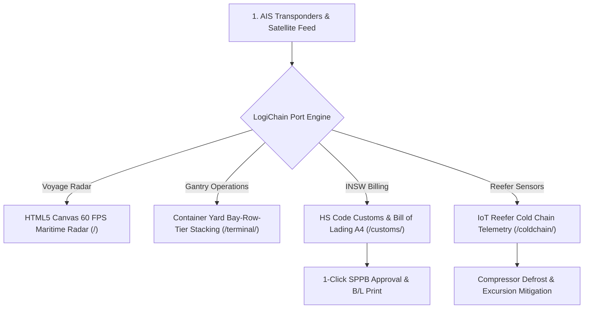

# ⚓ LogiChain OS — Global Maritime Freight, Terminal Yard & INSW Customs
### The 11th Titan (The Undecagon Milestone — 100M+ Local Tokens Burned)

[](https://olyxmintabansos-byte.github.io/logichain-os/)
[](https://olyxmintabansos-byte.github.io/logichain-os/)
[](https://olyxmintabansos-byte.github.io/logichain-os/terminal/)
[](https://olyxmintabansos-byte.github.io/logichain-os/customs/)
[](https://olyxmintabansos-byte.github.io/logichain-os/coldchain/)

---

## 🌐 Live Production Routes (100% Client-Side Local-First)

- **Pusat Komando Armada & AIS Radar 60 FPS:** [https://olyxmintabansos-byte.github.io/logichain-os/](https://olyxmintabansos-byte.github.io/logichain-os/)
- **Container Yard Bay-Row-Tier Stacking Matrix:** [https://olyxmintabansos-byte.github.io/logichain-os/terminal/](https://olyxmintabansos-byte.github.io/logichain-os/terminal/)
- **INSW HS Code Customs & Bill of Lading A4:** [https://olyxmintabansos-byte.github.io/logichain-os/customs/](https://olyxmintabansos-byte.github.io/logichain-os/customs/)
- **IoT Reefer Cold Chain Telemetry:** [https://olyxmintabansos-byte.github.io/logichain-os/coldchain/](https://olyxmintabansos-byte.github.io/logichain-os/coldchain/)

---

## 🏛️ System Architecture



---

## 💎 Fitur Unggulan LogiChain OS

1. **Live AIS Sea Lanes Radar 60 FPS Canvas (`/`)**:
   - Vektor kecepatan kapal knot & haluan derajat pada Selat Malaka, Singapura, dan Priok.
2. **Container Yard Bay-Row-Tier Stacking Matrix (`/terminal/`)**:
   - Matriks koordinat 2D gantry crane dengan pemindahan kontainer 1-klik dan indikator Reefer/Hazmat.
3. **INSW HS Code Customs & Bill of Lading A4 (`/customs/`)**:
   - Kalkulator tarif kepabeanan (Bea Masuk, PPN 11%, PPh 22) dan jalur pabean Hijau/Kuning/Merah.
   - Dokumen resmi *Bill of Lading (B/L) & PIB* berstandar cetak A4 Pelindo/Bea Cukai (`window.print()`).
4. **IoT Reefer Cold Chain Telemetry (`/coldchain/`)**:
   - Pemantauan suhu & kelembapan real-time kargo vaksin dan makanan beku via Recharts.
   - Simulator ekskursi suhu dan tombol *Recalibrate & Defrost* 1-klik.

---

## 🛠️ Build & Verification Directives

```bash
# 1. Pastikan public/.nojekyll ada
touch public/.nojekyll

# 2. Build static export
npm run build

# 3. Buat out/.nojekyll
touch out/.nojekyll

# 4. Commit dan push ke branch master
git add .
git commit -m "feat: complete LogiChain OS Sprint 3 & 4 - Customs B/L & Cold Chain Telemetry"
git push origin master || git push origin main

# 5. Deploy ke GitHub Pages
npx --yes gh-pages -d out -b gh-pages --dotfiles
```
